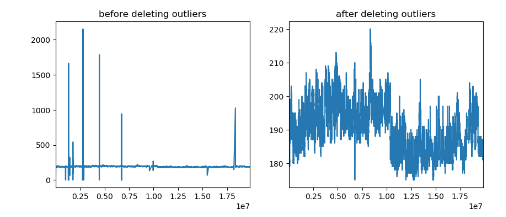

# 

# ASHRAE-energy-prediction

The code in this repository is for [Kaggle competition ashrae energy prediction](https://www.kaggle.com/c/ashrae-energy-prediction). I am still improving the code, so the resulting public score from this code might not be attractive enough yet :D

## Technologies
* Jupyter Notebook
* Pandas
* Numpy
* AWS Sagemaker
* lightGBM
* xgboost

## To do
* Construct different feature sets for different sites
* Train different models for different sites

## Descriptions of files

[ashrae_data_preparation.ipynb](ashrae_data_preparation.ipynb)

Prepare data locally for training in AWS

Output files can then be mannually uploaded AWS's s3 services for training

[ashrae_lightGBM.ipynb](ashrae_lightGBM.ipynb)

borrowed from [this Kaggle notebook](https://www.kaggle.com/aitude/ashrae-kfold-lightgbm-without-leak-1-08/comments). I use it as a starting point. 
This notebook cleans data very lightly
fills missing weather information with relevant mean value of the day of the month
uses KFold lightGBM model
The Kaggle public score was 2.227.

[ashrae_lightGBM_with_data_cleaned.ipynb](ashrae_lightGBM_with_data_cleaned.ipynb): use data where outliers are removed more thoroughly, fill missing weather information with interpolate within a site and use KFold lightGBM model. The Kaggle public score for the result from this notebook was 1.139. From this example, we can see the magic of cleaning data.

[ashrae_outliers_deletion.ipynb](ashrae_outliers_deletion.ipynb): remove outliers site by site, building by building. This notebook removes about 4% rows of data.

[ashrae_outliers_deletion_verbose.ipynb](ashrae_outliers_deletion_verbose.ipynb): verbose version of ```ashrae_outliers_deletion.ipynb``` that comes with plot showing data before and after deleting outliers which explains why certain data is considered as outliers and needs to be deleted.

### [ashrae_aws](ashrae_aws/) - AWS Sagemaker notebooks

[data_preparation.ipynb](ashrae_aws/data_preparation.ipynb): almost same as notebook ```ashrae_data_preparation.ipynb``` except that it prepares data in AWS and writes output files to S3 automatically.

[xgboost_train.ipynb](ashrae_aws/xgboost_train.ipynb): trains a model with AWS built-in xgboost algorithm.

_Note: the model was trained with only 6 rounds due to the lack of mememory. I once trained it untill 28 rounds when the validation stops improving. But model trained with 28 rounds wasn't deplolyed successfully due to lack of mememory eventhough I have already created two support cases to ask for more resources (instances with more mememory). I stop trying more powerful instances when the bills went up :D._

[xgboost_prediction.ipynb](ashrae_aws/xgboost_prediction.ipynb): uses the trained xgboost model to predict.
